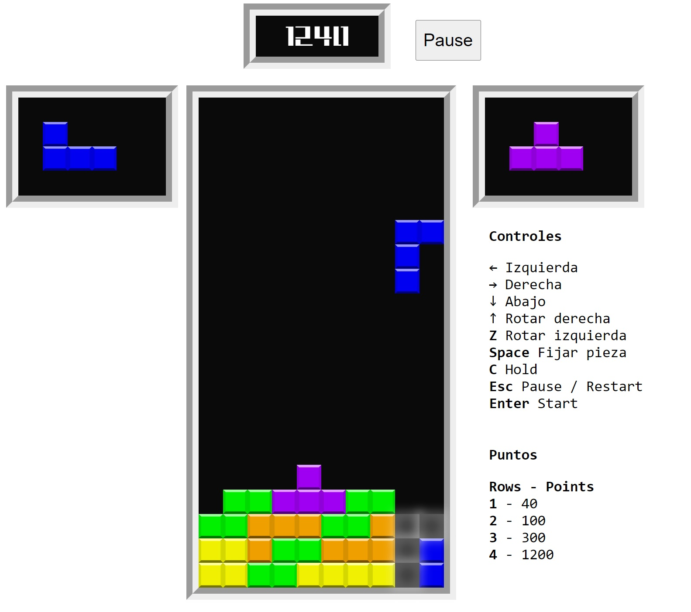

# tetris

Tetris game in elm.



Also includes functionalities as :
  - Basic wall kicking mechanism
  - Shadow preview
  
Other rules :
  - If a piece stays with no commands from user and touching floor for one it will be fixed to board
  - If a piece has been touching floor withouth release for more than 3 actions it will be fixed.
  - If a piece with 3 actions wile touching is released it will only have one action more while being grounded before fixing.
  - Pieces spawn off the board


 # Compilar el código

 ```
elm make src/Main.elm --output build/tetris.js
 ```

Build optmimizado
 ```
elm make src/Main.elm --output --optimize build/tetris.js
 ```

Minimizado
 ```
uglifyjs build/tetris.js --compress "pure_funcs=[F2,F3,F4,F5,F6,F7,F8,F9,A2,A3,A4,A5,A6,A7,A8,A9],pure_getters,keep_fargs=false,unsafe_comps,unsafe" | uglifyjs --mangle --output build/tetris.min.js
 ```

Si uglify no está disponible
```
npm install uglify-js --global
``` 

# Arrancar la web en desarrollo
Live server sobre app.html 

# Añadir el juego a un documento html
  
  importar el fichero .js y .css y añadir las líneas del body.

```
  <script src="../build/tetris.js"></script>
    <link rel="stylesheet" href="tetris.css" />

</head>

<body>
    
    <div id="tetris"></div>

    <script>
        var tetris = Elm.Main.init({
          node: document.getElementById('tetris')
        });
    </script>
```

# Referencia

Información sobre tetris, reglas y mecánicas

https://tetris.wiki/Super_Rotation_System

https://tetris.wiki/Tetris_Dimensions

Guia de elm

https://guide.elm-lang.org/install/elm.html

https://package.elm-lang.org/packages/perty/matrix/latest/Matrix

Para saber más sobre optimizar codigo para producción Leer: 

https://github.com/elm/compiler/blob/master/hints/optimize.md